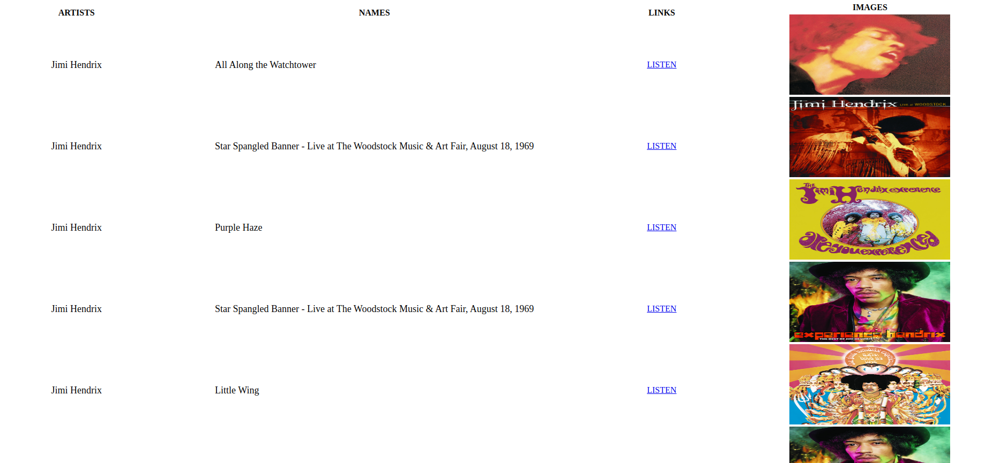

# Contents
* [About](#about)
* [Installation](#installation)
* [Tools and Technologies](#tools-and-technologies)
* [Main Features](#main-features)


# About

This sample web application, based on Django, provides the ability to view popular songs and singers which searched music genre on the Spotify platform in a table, according to the music genre which is typed.

## Tools and Technologies

* Django REST Framework
* Spotify APIs
* Html/CSS

## Installation

Use the package manager [pip](https://pip.pypa.io/en/stable/) to install:

```bash
pip install -r requirements.txt
```

```bash
python manage.py runserver 8000
```
## Main Features

### Search 


### List 



## License
[GNU 3.0](https://github.com/omeraydemirr/tracks-spotify/blob/31f161d2d447a10bb812e82275609430c9f79bec/LICENSE)
